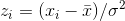

# Unidad 3: Variables Aleatorias y Gráficos

## Ejercicio 1: Importe un csv de su compañero

* Utilice la base de datos de un compañero creada en la sesión pasada.

## Ejercicio 2: Importe su conjunto de funciones

* Genere un archivo `ancilliary_funcs.py` para guardar las funciones creadas en la sesión pasada e impórtelo.
* Utilice las funciones creadas para inspeccionar la cantidad de casos perdidos de la muestra de su compañero.

## Ejercicio 3: Estime el puntaje z para las 10 primeras y últimas observaciones de las variables con una menor cantidad de datos perdidos

* Genere una nueva columna en la tabla de datos mediante funciones vectorizadas. Recuerde que para calcular el puntaje z de una observación se utiliza la fórmula: .
* Para ordenar los valores pueden utilzar la función `sort_values` del `DataFrame` analizado. Lean la documentación asociada al argumento `by`. Para evitar conflictos en la sobreescritura 
* Asegúrense de eliminar las observaciones que tengan valores perdidos con `dropna`. Lean la documentación asociada al método `subset`.
* Seleccionen las primeras y últimas 10 observaciones de la base reordenada. ¿Qué características en común se encuentran?

## Ejercicio 4: Estime el puntaje z de las regiones

* Para ello, modifique la función para generar dotplots de la semana pasada, donde deberá agregar una opción al argumento `statistic` para calcular el puntaje z.

## Ejercicio 5: Genere un método que devuelva un gráfico comparando dos curvas de densidad

* El método debe contener los siguientes argumentos:
    - `df1`: Su base de datos segmentada.
    - `df2`: Base segmentada de su compañero.
    - `variable`: Variable a contrastar.
    - `log`: Booleano. Si es `True` transformar la variable al logaritmo. Por defecto debe ser `False`.
* Grafique las curvas para `imf_pop`, `gle_cgdpc` y `undp_hdi`. ¿En qué casos es necesario utilizar logaritmos? ¿Por qué?
  
