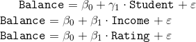
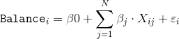

# Unidad: Regresíon - Sesión 1

### Regresión (desde la econometría)

### Sobre la base de datos

* En esta actividad trabajaremos con un registro de clientes de un banco e información sobre su salud financiera. La base contenida en el csv `Credit` contiene las siguientes variables:

* `Income`: Ingreso anual disponible en miles de dólares.
* `Limit`: Límite del crédito.
* `Rating`: Ranking del crédito.
* `Cards`: Cantidad de tarjetas de credito.
* `Age`: Edad del usuario.
* `Education`: Años de educación del usuario.
* `Gender`: ¿Hombre o mujer?
* `Student`: ¿Es estudiante?
* `Married`: ¿Está casado?
* `Ethnicity`: Etnicidad del usuario (Caucásico, Afroamericano, Asiático)
* `Balance`: Promedio de deuda en tarjeta de crédito de usuario.

* Para efectos prácticos del ejercicio, nos interesa saber sobre los determinantes de la variación en el promedio de deuda en tarjeta de crédito. A lo largo del ejercicio generaremos modelos econométricos para inspeccionar los efectos de distintos atributos.

## Ejercicio 1: Prepare el ambiente de trabajo

* Importe las librerías básicas para el análisis de datos.
* Incluya los import base de `statsmodels`.
* Importe la base de datos `Credit.csv` y elimine la columna `Unnamed: 0`.
* Siguiendo las buenas prácticas, genere variables binarias para capturar el efecto del grupo minoritario en cada variable. Para el caso de `Ethnicity`, genere binarias para `AfricanAmerican` y `Asian`.
    - _tip_: Utilice `value_counts()` para revisar la cantidad de casos en las variables categóricas.

## Ejercicio 2: Genere gráficos descriptivos para las variables contínuas

* Genere una función llamada `plot_hist` que genere un histograma de la variable e indique la media y mediana de la misma. Agrege una leyenda para indicar qué representa cada línea.
* ¿Cuál es el comportamiento de `Balance`, `Income`, `Cards` y `Rating`?

## Ejercicio 3: Regresión Lineal Simple

* A continuación generaremos una serie de modelos simples:

* Utilizando `statsmodels`, comente brevemente los siguientes puntos:
    - ¿Qué variable presenta un mayor poder explicativo de la variabilidad de `Balance`?
    - ¿Qué podemos decir sobre el comportamiento de `Student`?
        - ¿Qué pasa si aplicamos una prueba de hipótesis para muestras independientes de `Balance` entre aquellos que son y no son estudiantes?

## Ejercicio 4: Genere un modelo que incluya todos los regresores

* Comente brevemente sobre el poder explicativo en la varianza de $y$ y las principales características de los predictores.

## Ejercicio 5: Depure el modelo e incluya sólo los predictores significativo

* En base al modelo anterior, refactorize e incluya sólo las variables con un nivel de significancia $p-value\leq.025$. Comente brevemente sobre el poder explicativo en la varianza de $y$ y las principales características de los predictores.
* ¿Mejoró o empeoró el modelo con la reducción de regresores?

### Ejercicio 6: 

* Utilizando `lmplot` de `seaborn`, inspeccione el comportamiento de los tres principales determinantes.

