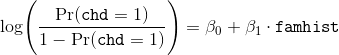
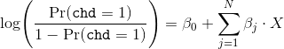

# Unidad: Clasificación - Sesión 1

* Para poder realizar esta actividad debes haber revisado la lectura correspondiente a la semana.
* Crea una carpeta de trabajo y guarda todos los archivos correspondientes (notebook y csv).
* Una vez terminada la actividad, comprime la carpeta y sube el `.zip` a la sección correspondiente.

## Descripción de Actividades

* En esta sesión trabajaremos con un archivo `.csv` donde se registraron las características de una serie de individuos para analizar la propensidad a tener alguna enfermedad coronaria.

* `sbp`: Presión Sanguínea Sistólica.
* `tobacco`: Promedio tabaco consumido por día.
* `ldl`: Lipoproteína de baja densidad.
* `adiposity`: Adiposidad.
* `famhist`: Antecedentes familiares de enfermedades cardiácas. (Binaria)
* `types`: Personalidad tipo A
* `obesity`: Obesidad.
* `alcohol`: Consumo actual de alcohol.
* `age`: edad.
* `chd`: Enfermedad coronaria. (dummy)

## Ejercicio 1: Preparar el ambiente de trabajo

* Importe los módulos básicos para el análisis de datos
* Importe `seaborn`.
* Importe `statsmodels`
* Importe `LogisticRegression`, `train_test_split`, `StandardScaler`, `classification_report` y `roc_curve` de `sklearn`

## Ejercicio 2

* A continuación se presenta el siguiente modelo a estimar:

* Para ello ejecute los siguientes pasos:
    1. Recodifique `famhist` a dummy, asignando 1 a la categoría minoritaria.
    - Utilice `smf.logit` para estimar el modelo.

* Implemente una función `inverse_logit` que realize el mapeo de log-odds a probabilidad.

* Con el modelo estimado, responda lo siguiente:
    1. ¿Cuál es la probabilidad de un individuo con antecedentes familiares de tener una enfermedad coronaria?
    - ¿Cuál es la probabilidad de un individuo sin antecedentes familiares de tener una enfermedad coronaria?
    - ¿Cuál es la diferencia en la probabilidad entre un individuo con antecedentes y otro sin antecedentes?

* Replique el modelo con `smf.ols` y comente las similitudes entre los coeficientes estimados. 
    - _tip_: Utilice 

## Ejercicio 3: Estimación completa

* Implemente un modelo con la siguiente forma

* Depure el modelo manteniendo las variables con significancia estadística al 95%.
* Compare los estadísticos de bondad de ajuste entre ambos.
* Reporte de forma sucinta el efecto de las variables en el log-odds de tener una enfermedad coronaria.

## Ejercicio 4: Estimación de perfiles

* A partir del modelo depurado, genere las estimaciones en log-odds y posteriormente transfórmelas a probabilidades con `inverse_logit`. Los perfiles a estimar son los siguientes:

1. La probabilidad de tener una enfermedad coronaria para un individuo con características similares a la muestra.
- La probabilidad de tener una enfemerdad coronaria para un individuo con altos niveles de lipoproteína de baja densidad, __manteniendo todas las demás características constantes__.
- La probabilidad de tener una enfemerdad coronaria para un individuo con bajos niveles de lipoproteína de baja densidad, __manteniendo todas las demás características constantes__.

