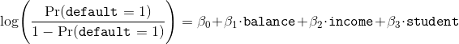

# Unidad: Clasificación - Sesión 2

* Para poder realizar esta actividad debes haber revisado la lectura correspondiente a la semana.
* Crea una carpeta de trabajo y guarda todos los archivos correspondientes (notebook y csv).
* Una vez terminada la actividad, comprime la carpeta y sube el `.zip` a la sección correspondiente.

## Descripción de Actividades

* En esta sesión trabajaremos con una base de datos sobre clientes morosos de un banco. Dentro de ésta se registran las siguientes observaciones:

1. `default`: Variable binaria. Registra si el cliente entró en morosidad o no.
- `income`: Ingreso promedio declarado por el cliente.
- `balance`: Total de saldo en la cuenta de crédito.
- `student`: Variable binaria. Registra si el cliente es estudiante o no.

## Ejercicio 1: Preparación del ambiente de trabajo

* Importe los módulos básicos para el análisis de datos
* Importe `seaborn`.
* Importe `statsmodels`
* Importe `LogisticRegression`, `train_test_split`, `StandardScaler`, `classification_report` y `roc_curve` de `sklearn`

## Ejercicio 2: Análisis exploratorio

* Explore las principales relaciones entre las variables. Utilizando los métodos `boxplot` y `lmplot` de `seaborn` implemente los siguientes gráficos.

    * Un boxplot del balance total de las cuentas, segmentado por el status de estudiante.
    * Un boxplot del ingreso total de cada cliente, segmentado por el status de estudiante.
    * Un boxplot del balance total de las cuentas, segmentado por el status de default.
    * Un boxplot del ingreso total de cada cliente, segmentado por el status de default.
    * Un diagrama de dispersión entre `balance` e `income`, segmentado por el status de estudiante.
    * Un diagrama de dispersión entre `balance` e `income`, segmentado por el status de default.

* Comente brevemente sobre los principales patrones de comportamiento.
* _tip_: Puede utilizar el argumento `hue` en `lmplot` para identificar las observaciones por status.

## Ejercicio 3: Modelación econométrica

* Recodifique las variables `student` y `default` para que adquieran atributos numéricos.
* Implemente el siguiente modelo econométrico:

* A partir de este modelo, depúrelo y mantenga las principales características. Ejecute de nuevo el modelo y comente brevemente sobre el comportamiento de los atributos.

## Ejercicio 4: Entrenar

* A partir del modelo depurado, genere un modelo predictivo con las siguientes características:

1. Estandarize la matriz de atributos.
- Genere subconjuntos de entrenamiento y validación, separando el 33% de la muestra en el conjunto de validación.
- Implemente el modelo sin alterar los hiperparámetros.
- Genere la predicción de las clases y de la probabilidad.
- Reporte las métricas de precision, recall y f1 para ambas clases.
- Grafique la curva Receiver Operator Characteristic.

* En base a los pasos, comente sobre el desempeño predictivo del modelo.

