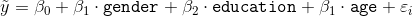

# Unidad: Dimensionalidad y Agrupación - Sesión 1

## Modelación psicométrica de factores

* Para poder realizar esta actividad debes haber revisado la lectura correspondiente a la semana.
* Crea una carpeta de trabajo y guarda todos los archivos correspondientes (notebook y csv).
* Una vez terminada la actividad, comprime la carpeta y sube el `.zip` a la sección correspondiente.

### Sobre el ejemplo

* Para esta actividad utilizaremos un subconjunto de 25 items de la _International Personality Item Pool_, aplicados a 2800 individuos. El objetivo de esta información es desarrollar perfiles de personalidad en base a una serie de oraciones asociadas a las características _Amabilidad_, _Escrupolisidad_, _Extroversión_, _Neuroticismo_, _Apertura_ Los individuos deben responder qué tan adecuada es la oración respecto a su personalidad en base a 6 categorías:

    - 1: No me representa para nada.
    - 2: No me representa.
    - 3: Algunas cosas no me representan.
    - 4: Algunas cosas me representan.
    - 5: Me representa.
    - 6: Me representa completamente.

* Las 25 preguntas son:
    * `A1`  Soy indiferente a los sentimientos de otros.
    * `A2` Me preocupo del bienestar de otros. 
    * `A3` Sé cómo confortar a otros.
    * `A4` Me agradan los niños. 
    * `A5` Hago sentir tranquila a la gente. 
    * `C1` Soy exacto en mi trabajo.
    * `C2` Sigo con mis tareas hasta que todo esté perfecto.
    * `C3` Hago cosas siguiendo un plan.
    * `C4` Hago cosas con el mínimo esfuerzo.
    * `C5` Pierdo mi tiempo. 
    * `E1` No hablo mucho con las personas.
    * `E2` Me es dificil acercarme a otros.
    * `E3` Sé cómo cautivar gente.
    * `E4` Hago amigos de forma fácil. 
    * `E5` Puedo tomar el cargo de las cosas. 
    * `N1` Me enojo con facilidad.
    * `N2` Me irrito con facilidad.
    * `N3` Tengo cambios de humor frecuentes.
    * `N4` Usualmente me siento melancólico. 
    * `N5` Entro en pánico con facilidad. 
    * `O1` Estoy lleno de ideas.
    * `O2` Evito leer material difícil.
    * `O3` Tiendo a llevar la conversación a niveles más altos.
    * `O4` Dedico tiempo a la reflexión de cosas. 
    * `O5` No profundizaré sobre una materia específica. 
    
* Se registraron una serie de covariables sobre características demográficas de los encuestados:
    * `gender` Hombre = 1, Mujer =2.
    * `education` 1 = Educación Media Incompleta, 2 = Educación Media Completa, 3 = Educación Universitaria Incompleta, 4 = Educación Universitaria Completa 5 = Estudios de Postgrado.
    * `age` Edad en Años.
    
* Implementaremos un modelo de extracción factorial para identificar los principales perfiles psicológicos.

## Ejercicio 1: Lectura de archivos

* Importe las librerías necesarias para el análisis factorial siguiendo las convenciones.
* Importe la base de datos `bfi.csv` y asígnela a un objeto `df`.
* Solicite las primeras 5 observaciones con `head`.

## Ejercicio 2: Preprocesamiento

* Elimine las columnas redundantes de la base, tal como `'Unnamed: 0'`.
* Analice el patrón de datos perdidos con `missingno`. Comente cuáles son las principales variables con mayores tasas de valores perdidos.
* Genere un nuevo objeto donde almacenará la base sin valores perdidos.

## Ejercicio 3: Descripción

* Separe en un nuevo objeto `DataFrame` la batería de preguntas a extraer.
* Reporte las medias para cada uno de las preguntas de la batería. Esto lo puede lograr con un dotplot.
* Genere una matriz de correlaciones con este nuevo objeto. Visualícelo con `heatmap`. Comente sobre los principales patrones de correlación entre las preguntas de la batería.

## Ejercicio 4: Extracción de factores

* Antes de iniciar la extracción de factores, inspeccione la ideonidad de la batería de preguntas para realizar un análisis factorial mediante la prueba de esferacidad de Barlett y Kaiser-Meyer-Olkin. Comente los resultados.
* Instancie un objeto con `FactorAnalyzer()` donde se estimen 10 dimensiones latentes y no se aplique rotación.
* Genere un scree plot entre los eigenvalues del modelo y la cantidad de dimensiones estimables.
* Refactorice el objeto con `FactorAnalyzer()` para incluir la cantidad de dimensiones válidas que informó el scree plot. 
* Extraiga las cargas $\lambda$ del modelo e identifique qué items están asociados a cada factor. Comente sobre qué significa cada factor construído.

## Ejercicio 5: Modelación de factores

* Extraiga los puntajes del modelo factorial a su base de datos.
* Grafique la densidad de cada uno con `kdplot`.
* Modele y comente brevemente sobre cuáles son los principales determinantes de cada factor en base al siguiente modelo estimable:

